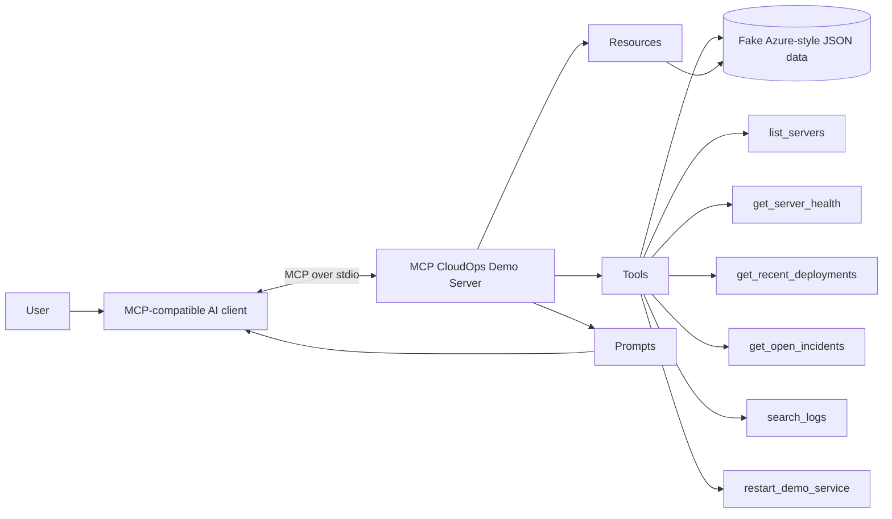

# MCP CloudOps Demo

A free, public, portfolio-friendly **Model Context Protocol (MCP)** demo that shows how an AI client can discover and use CloudOps capabilities without requiring a real Azure subscription, API key, or production credentials.

The server exposes **tools, resources, and prompts** backed by deterministic fake Azure-style infrastructure data. It is designed to be easy to clone, run locally, inspect with MCP Inspector, containerize, and later extend with real Azure or GitHub integrations.

> **Safety:** this repository never connects to real infrastructure by default. Even the restart capability is a simulation.

## What this demonstrates

A normal chatbot only knows what is in its conversation context. An MCP-enabled client can also discover structured capabilities exposed by an MCP server.

In this demo, the client can:

- discover production and staging servers;
- inspect server health and utilization;
- correlate incidents, deployments, and logs;
- read infrastructure inventory as MCP resources;
- use reusable incident-investigation prompts;
- request a simulated operational action with explicit confirmation.

## Architecture



A larger diagram is also available in [`docs/architecture.md`](docs/architecture.md).

## MCP primitives used

### Tools

| Tool | Purpose |
|---|---|
| `list_servers` | List demo servers, optionally by environment |
| `get_server_health` | Inspect status, CPU, memory, service, and region |
| `get_recent_deployments` | Review recent deployments |
| `get_open_incidents` | Retrieve active incidents |
| `search_logs` | Filter deterministic demo logs |
| `restart_demo_service` | Simulate a restart with explicit confirmation |

### Resources

| URI | Purpose |
|---|---|
| `infra://inventory/all` | Complete demo inventory |
| `infra://inventory/production` | Production-only inventory |
| `ops://incidents/open` | Current open incidents |

### Prompts

| Prompt | Purpose |
|---|---|
| `investigate_incident(service)` | Structured incident investigation workflow |
| `daily_cloudops_summary(environment)` | Concise health-summary workflow |

## Demo scenario

Suppose the user asks:

> Which production servers are unhealthy or under resource pressure?

An MCP client can discover and call `list_servers(environment="prod")`, see that `api-prod-02` is degraded with high CPU, and then decide to call `get_server_health` or inspect incidents and logs.

A follow-up might be:

> Investigate the issue affecting payments-api and tell me whether it is related to a deployment.

The client can combine multiple MCP capabilities:

```text
User request
   |
   v
get_open_incidents("payments-api")
   |
   v
list_servers("prod")
   |
   v
get_server_health("api-prod-02")
   |
   v
get_recent_deployments(service="payments-api")
   |
   v
search_logs(service="payments-api")
   |
   v
AI correlates evidence and explains the likely cause
```

This is the core value proposition of MCP: the model can work with standardized external capabilities instead of having every integration hard-coded into the chat application.

## Repository structure

```text
mcp-cloudops-demo/
├── .github/
│   └── workflows/
│       └── ci.yml
├── docs/
│   └── architecture.md
├── examples/
│   └── prompts.md
├── src/
│   └── mcp_cloudops/
│       ├── data/
│       │   ├── deployments.json
│       │   ├── incidents.json
│       │   ├── logs.json
│       │   └── servers.json
│       ├── prompts/
│       │   └── cloudops.py
│       ├── resources/
│       │   └── cloudops.py
│       ├── tools/
│       │   └── cloudops.py
│       ├── server.py
│       └── store.py
├── tests/
│   ├── test_data_relationships.py
│   └── test_store.py
├── Dockerfile
├── docker-compose.yml
├── LICENSE
├── pyproject.toml
└── README.md
```

## Requirements

- Python 3.11 or newer
- `pip`, `uv`, or another Python package manager
- Optional: Docker
- Optional: an MCP-compatible client or MCP Inspector

## Quick start with Python

Clone the repository and create a virtual environment:

```bash
git clone https://github.com/YOUR-USERNAME/mcp-cloudops-demo.git
cd mcp-cloudops-demo
python -m venv .venv
```

Activate it.

Linux/macOS:

```bash
source .venv/bin/activate
```

Windows PowerShell:

```powershell
.\.venv\Scripts\Activate.ps1
```

Install the project:

```bash
python -m pip install -e '.[dev]'
```

Run the MCP server over stdio:

```bash
mcp-cloudops-demo
```

The process will wait for an MCP client to communicate over stdin/stdout. That is expected.

## Test with MCP Inspector

The official Python MCP SDK includes development tooling when installed with the CLI extra.

If your environment has the MCP CLI available, run:

```bash
mcp dev src/mcp_cloudops/server.py
```

Then open the Inspector URL printed in your terminal. Explore the **Tools**, **Resources**, and **Prompts** tabs.

If `mcp` is not installed as a CLI command, install the SDK CLI extra:

```bash
python -m pip install 'mcp[cli]'
```

## Run tests

```bash
pytest
```

Run linting:

```bash
ruff check src tests
```

## Run with Docker

Build the image:

```bash
docker build -t mcp-cloudops-demo .
```

Run it interactively because stdio is the MCP transport used by this demo:

```bash
docker run --rm -i mcp-cloudops-demo
```

Or with Docker Compose:

```bash
docker compose run --rm mcp-cloudops-demo
```

## Example client configuration

MCP hosts generally need only the command that starts the stdio server. The exact configuration format depends on your client.

A typical local configuration conceptually looks like this:

```json
{
  "mcpServers": {
    "cloudops-demo": {
      "command": "python",
      "args": ["-m", "mcp_cloudops.server"]
    }
  }
}
```

If the package is installed into a virtual environment, point the host at that environment's Python executable or use the installed `mcp-cloudops-demo` command.

## Suggested prompts

Try:

- `Which production servers are unhealthy or under resource pressure?`
- `Investigate the open incident affecting payments-api.`
- `Did a recent deployment correlate with the current production issue?`
- `Show ERROR logs for api-prod-02 and explain the likely cause.`
- `Use the investigate_incident prompt for payments-api.`
- `Read infra://inventory/production and summarize capacity risks.`
- `Simulate restarting api-prod-02, but ask me for confirmation first.`

More examples are in [`examples/prompts.md`](examples/prompts.md).

## Why fake data?

A public MCP demo should be runnable by anyone without exposing secrets or requiring cloud spend. The JSON fixtures provide:

- zero infrastructure cost;
- deterministic behavior for demonstrations;
- safe public-source control;
- repeatable automated tests;
- a clean boundary between MCP capabilities and the eventual real data source.

## Extending the demo to real Azure

The easiest upgrade path is to keep the MCP-facing functions and replace `load_json()` with an adapter layer.

For example:

```text
MCP Tool
   |
   v
CloudOps service interface
   |
   +--> DemoJsonProvider
   |
   +--> AzureProvider
          |
          +--> Azure Resource Graph
          +--> Azure Monitor
          +--> Log Analytics
          +--> Azure DevOps / GitHub
```

Potential real integrations include:

- **Azure Resource Graph** for VM/resource inventory;
- **Azure Monitor** for metrics;
- **Log Analytics** for KQL queries;
- **Azure Update Manager** for patch posture;
- **GitHub** for commits, pull requests, and Actions runs;
- **Azure DevOps** for pipelines and deployment history.

For a public portfolio version, prefer read-only permissions and use environment variables or managed identity rather than storing credentials in the repository.

## Example future multi-server scenario

A stronger second version of this project could demonstrate an AI client correlating data across multiple MCP servers:

```text
Developer
  |
  | "Why did the deployment fail?"
  v
AI / MCP Host
  |
  +--> GitHub MCP server ------> commit / pull request
  |
  +--> Azure MCP server -------> deployment status
  |
  +--> Observability MCP ------> application logs
  |
  v
Correlated incident explanation
```

That demonstrates why a protocol is useful: each domain can expose capabilities independently while the host provides the conversational orchestration.

## Security considerations

This repository intentionally follows several safe-demo patterns:

- no secrets are committed;
- no cloud credentials are required;
- operational data is fictional;
- write-like actions are simulations;
- the simulated restart requires an explicit `confirmed=true` parameter;
- GitHub Actions uses read-only repository contents permission;
- tests verify fixture relationships so demos stay coherent.

If you replace the fake provider with real infrastructure, add authentication, authorization, audit logging, least-privilege access, input validation, and confirmation controls before exposing mutating tools.

## CI

The included GitHub Actions workflow runs on pushes and pull requests and validates:

- Python 3.11;
- Python 3.12;
- Ruff linting;
- Pytest tests.

## Useful MCP references

- Model Context Protocol: https://modelcontextprotocol.io/
- Official Python SDK: https://github.com/modelcontextprotocol/python-sdk
- MCP specification: https://github.com/modelcontextprotocol/modelcontextprotocol

## License

MIT. See [`LICENSE`](LICENSE).

## Portfolio talking points

When demonstrating this repository, emphasize these points:

1. The AI host is separate from the MCP server.
2. The server advertises capabilities instead of embedding chatbot logic.
3. Tools are actions/queries, resources are addressable context, and prompts are reusable workflows.
4. The same MCP server can be consumed by different compatible hosts.
5. The fake-data provider can be replaced without redesigning the MCP interface.
6. Mutating operations should have stronger authorization and confirmation controls than read operations.

---

Built as an educational CloudOps example. All infrastructure names, incidents, deployments, and metrics in the default dataset are fictional.
