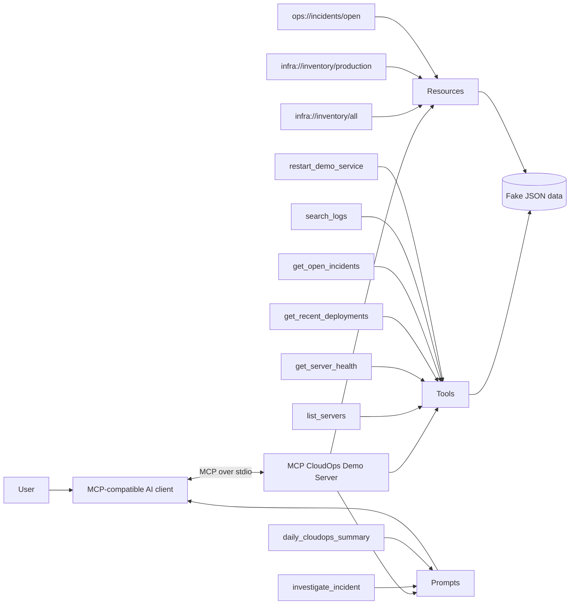
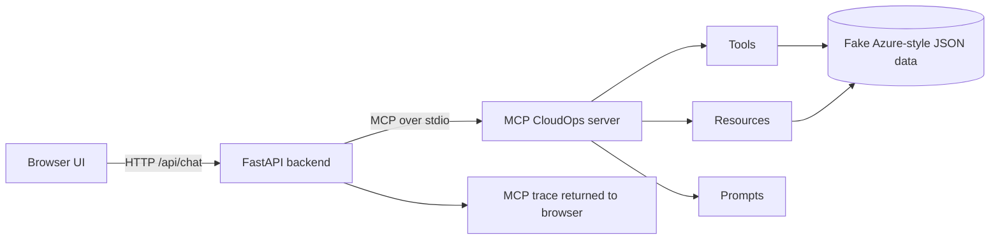

# Architecture

## Design goals

- Free to run locally.
- Safe for a public GitHub repository.
- No Azure subscription or API keys required.
- Deterministic data makes demos and tests repeatable.
- Separation between MCP interface and data source makes future Azure integration straightforward.

## Browser demo path

The optional browser UI is itself an MCP client. It does not bypass the MCP server or read the JSON fixtures directly.

The deterministic browser router keeps the public demo free: no external LLM API key is required. The MCP boundary remains real, so the router can later be replaced by an LLM-backed planner without changing the server's tool/resource/prompt contract.
